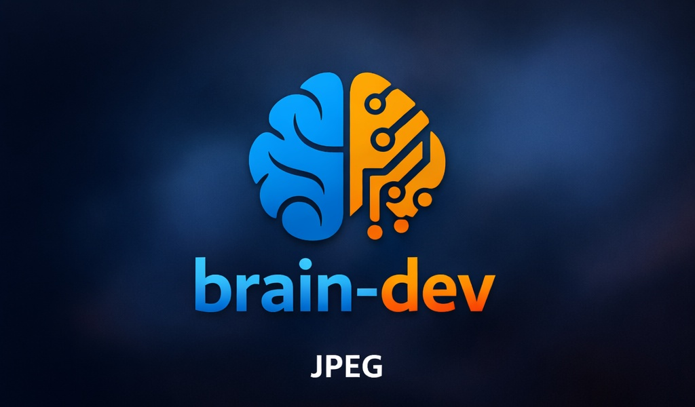

<p align="center">
  
</p>

<h1 align="center">Dev Brain — AI-Powered Code Intelligence via MCP</h1>

<p align="center">
  <a href="https://pypi.org/project/brain-dev/"></a>
  <a href="https://github.com/mcp-tool-shop-org/brain-dev/actions/workflows/test.yml"></a>
  <a href="https://codecov.io/gh/mcp-tool-shop-org/brain-dev"></a>
  <a href="https://www.python.org/downloads/"></a>
  <a href="https://opensource.org/licenses/MIT"></a>
  <a href="https://modelcontextprotocol.io/"></a>
</p>

<p align="center">
  <strong>Transform any AI assistant into a code analysis powerhouse.</strong><br />
  Dev Brain is an MCP server that gives LLMs the ability to analyze test coverage, generate pytest tests from AST, detect security vulnerabilities, and suggest refactoring improvements — works with Claude, Cursor, Windsurf, and any MCP-compatible client.
</p>

<p align="center">
  <a href="#-why-brain-dev">Why Dev Brain?</a> •
  <a href="#-quick-start">Quick Start</a> •
  <a href="#-tools">Tools</a> •
  <a href="#-security-scanning">Security</a> •
  <a href="#-examples">Examples</a>
</p>

---

## 🎯 Why Dev Brain?

**The Problem:** AI coding assistants can write code, but they can't *deeply analyze* your codebase. They don't know what's untested, what's vulnerable, or what needs refactoring.

**The Solution:** Dev Brain gives any MCP-compatible AI assistant **9 specialized analysis tools** that turn it into a senior developer who can:

| Capability | What It Does |
|------------|--------------|
| 🧪 **Test Generation** | Generate complete pytest files with fixtures, mocks, and edge cases — code that actually compiles |
| 🔒 **Security Audits** | Detect SQL injection, command injection, hardcoded secrets, and 6+ vulnerability patterns |
| 📊 **Coverage Analysis** | Find untested code paths, missing edge cases, and coverage gaps |
| 🔄 **Refactoring Suggestions** | Identify complexity hotspots, naming issues, and code duplication |
| 📝 **Documentation Analysis** | Find missing docstrings and generate documentation templates |
| 🎨 **UX Insights** | Analyze user-facing code for dropoff points and error patterns |

---

## 🚀 Quick Start

### Installation

```bash
pip install brain-dev
```

### Configure Your MCP Client

**Claude Desktop** — Add to `claude_desktop_config.json`:

```json
{
  "mcpServers": {
    "brain-dev": {
      "command": "brain-dev"
    }
  }
}
```

**Cursor, Windsurf, or other MCP clients** — Check your client's documentation for MCP server configuration.

### Start Using It

Just ask your AI assistant naturally:

- *"Analyze my authentication module for security vulnerabilities"*
- *"Generate pytest tests for the UserService class"*
- *"What test coverage gaps exist in my API handlers?"*
- *"Suggest refactoring for files with high complexity"*

---

## 🛠️ Tools

### Analysis Tools

| Tool | Description |
|------|-------------|
| `coverage_analyze` | Compare code patterns against test coverage, identify untested paths |
| `behavior_missing` | Find user behaviors and edge cases not handled in code |
| `refactor_suggest` | Analyze complexity, duplication, and naming issues |
| `ux_insights` | Extract UX patterns — dropoff points, error states, friction areas |

### Generation Tools

| Tool | Description |
|------|-------------|
| `tests_generate` | Create test suggestions based on coverage gaps |
| `smart_tests_generate` | **AST-based pytest generation** — produces complete test files with proper fixtures, mocks, and assertions that actually compile |
| `docs_generate` | Generate documentation templates for undocumented code |

### Security Tools

| Tool | Description |
|------|-------------|
| `security_audit` | OWASP-style vulnerability scanning with CWE mapping |

### Utility Tools

| Tool | Description |
|------|-------------|
| `brain_stats` | Server statistics, configuration, and health status |

---

## 🔒 Security Scanning

Dev Brain detects critical security vulnerabilities mapped to industry standards:

| Severity | Vulnerability | CWE | Example |
|----------|---------------|-----|---------|
| 🔴 **Critical** | SQL Injection | CWE-89 | `f"SELECT * FROM users WHERE id = {user_id}"` |
| 🔴 **Critical** | Command Injection | CWE-78 | `os.system(f"ping {host}")` |
| 🔴 **Critical** | Unsafe Deserialization | CWE-502 | `pickle.loads(user_data)` |
| 🟠 **High** | Hardcoded Secrets | CWE-798 | `api_key = "sk-1234..."` |
| 🟠 **High** | Path Traversal | CWE-22 | `open(f"/data/{filename}")` |
| 🟡 **Medium** | Insecure Cryptography | CWE-327 | `hashlib.md5(password)` |

---

## 📖 Examples

### Security Audit

```python
# Via MCP client
result = await client.call_tool("security_audit", {
    "symbols": [
        {
            "name": "execute_query",
            "file_path": "db.py",
            "line": 10,
            "source_code": 'cursor.execute(f"SELECT * FROM users WHERE id = {user_id}")'
        }
    ],
    "severity_threshold": "medium"
})
# Returns: SQL injection vulnerability detected (CWE-89)
```

### AST-Based Test Generation

```python
result = await client.call_tool("smart_tests_generate", {
    "file_path": "/path/to/your/module.py"
})
# Returns: Complete pytest file with fixtures, mocks, and edge case coverage
```

### Natural Language Usage

```
You: "Check my payment processing module for security issues"

AI: I'll run a security audit on your payment module...

Found 2 vulnerabilities:
🔴 Critical: SQL injection in process_payment() at line 45
🟠 High: Hardcoded API key detected at line 12

Recommendations:
1. Use parameterized queries instead of f-strings
2. Move API key to environment variables
```

---

## 🏗️ Architecture

```
┌─────────────────────────────────────────────────────────────┐
│                    DEV BRAIN MCP SERVER                     │
├─────────────────────────────────────────────────────────────┤
│  Analyzers                                                  │
│  ├─ CoverageAnalyzer    → Test gap detection                │
│  ├─ BehaviorAnalyzer    → Unhandled flow discovery          │
│  ├─ RefactorAnalyzer    → Complexity & naming analysis      │
│  ├─ UXAnalyzer          → Dropoff & error pattern detection │
│  ├─ DocsAnalyzer        → Documentation gap finder          │
│  └─ SecurityAnalyzer    → OWASP vulnerability scanner       │
├─────────────────────────────────────────────────────────────┤
│  Generators                                                 │
│  ├─ TestGenerator       → Coverage-based test suggestions   │
│  └─ SmartTestGenerator  → AST-powered pytest generation     │
└─────────────────────────────────────────────────────────────┘
```

---

## 📦 Versioning & Compatibility

Dev Brain follows [Semantic Versioning](https://semver.org/):

| Change type | Version bump | Example |
|-------------|-------------|---------|
| New tool, new optional field | **minor** (1.**1**.0) | Add `dependency_audit` tool |
| Bug fix, perf improvement | **patch** (1.0.**1**) | Fix false positive in security scan |
| Remove/rename tool, change JSON schema | **major** (**2**.0.0) | Remove deprecated `confidence` field |

**Stability guarantee:** Within a major version, existing tool names, required
input fields, and output JSON keys will not be removed or renamed.

**Python support:** We test against the four most recent CPython releases
(currently 3.11 – 3.14).  When a new CPython version ships, the oldest is
dropped in the next minor release.

---

## 🔧 Development

```bash
git clone https://github.com/mcp-tool-shop-org/brain-dev.git
cd brain-dev
python -m venv .venv && source .venv/bin/activate   # Windows: .venv\Scripts\activate
pip install -e ".[dev]"
pytest tests/ -v
```

Python 3.11, 3.12, 3.13, and 3.14 are supported. See [CONTRIBUTING.md](CONTRIBUTING.md) for full details.

---

## 🌐 Related Projects

- **[Model Context Protocol](https://modelcontextprotocol.io/)** — The open standard that makes this possible
- **[MCP Servers](https://github.com/modelcontextprotocol/servers)** — Official reference implementations
- **[Awesome MCP Servers](https://github.com/punkpeye/awesome-mcp-servers)** — Community server directory

---

## 🤝 Contributing

Contributions are welcome! See [CONTRIBUTING.md](CONTRIBUTING.md) for setup instructions and guidelines, and [SECURITY.md](SECURITY.md) for vulnerability reporting.

---

## 📄 License

MIT License — see [LICENSE](LICENSE) for details.

---

<p align="center">
  <strong>If Dev Brain helps you write better code, consider giving it a ⭐</strong>
</p>

<p align="center">
  <sub>Built for the MCP ecosystem • Made with 🧠 by developers, for developers</sub>
</p>
